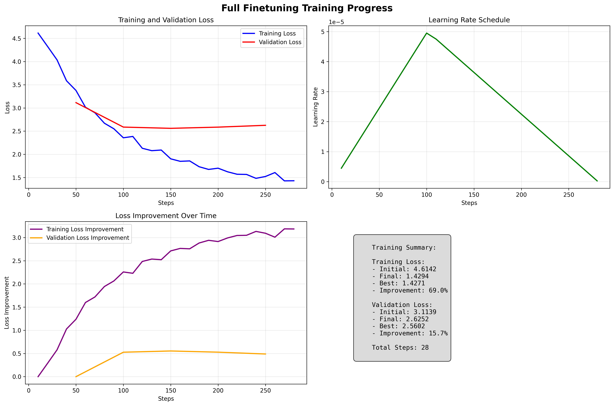
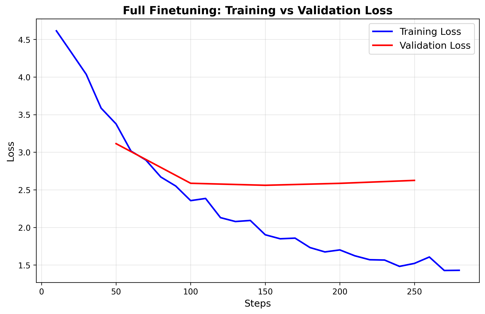

# LLM Fine-tuning Experiment: DistilGPT-2 on Shakespeare Dataset

This project explores fine-tuning DistilGPT-2 on a modern-to-Shakespearean translation dataset using RunPod GPU infrastructure. 

## Setup

### Requirements
- Python 3.11+
- CUDA-compatible GPU (for training)
- RunPod account (for GPU training)

### Installation

```bash
# Clone repository
git clone https://github.com/your-username/llm-finetune.git
cd llm-finetune

# Install dependencies using uv
uv sync

# Run data preparation
uv run python data/prepare_data.py

# Run training
uv run python training/full_finetune.py

```
**Tools used**: This project uses `uv` for dependency management and `ruff` for code formatting and linting.

## Overview

**Model**: DistilGPT-2 (82M parameters)  
**Dataset**: `harpreetsahota/modern-to-shakesperean-translation` (274 examples)  
**Infrastructure**: RunPod RTX 4000 Ada (20GB VRAM)  
**Total Cost**: ~$0.44 across multiple training runs  

## Dataset Analysis

The dataset contains modern English phrases paired with Shakespearean equivalents. However, analysis revealed significant quality issues:

- **Size**: Only 274 examples (extremely small for language model fine-tuning)
- **Quality**: Many slang-type mappings (e.g., "Snack" → "A sight most pleasing") that cannot be learnt with very few examples


The token length analysis shows most examples are reasonably short, with a mean length suitable for the model's context window.


## Training Configuration

```python
# Full Fine-tuning Configuration
model_name: "distilgpt2"
num_train_epochs: 10
learning_rate: 5e-5
per_device_train_batch_size: 4
gradient_accumulation_steps: 2
max_length: 512
train_examples: 220
validation_examples: 54
```

## Results

### Training Progress

The model showed clear learning dynamics over 10 epochs:





**Key Metrics:**
- **Training Loss**: 4.6142 → 1.4294 (69.0% improvement)
- **Validation Loss**: 3.1139 → 2.6252 (15.7% improvement)
- **Total Training Steps**: 280
- **Training Time**: ~20 minutes on RTX 4000 Ada

### Analysis

1. **Successful Learning**: Training loss decreased dramatically from 4.61 to 1.43
2. **Overfitting**: Large gap between training (1.43) and validation (2.63) loss
3. **Limited Generalization**: Small dataset size, so expected

## Model Evaluation

### Generation Parameters

All model outputs were generated using consistent parameters for fair comparison:

```python
# Generation settings used for all tests
max_new_tokens=50
do_sample=True
temperature=0.7
top_p=0.9
repetition_penalty=1.1
```

### Before Fine-tuning (Original DistilGPT-2)

The original model produces general text completions with no awareness of the instruction format:

```
Input: Convert to Shakespearean: I am hungry
Output: Convert to Shakespearean: I am hungry for a bit of time. So if you're just going to be late and have dinner, then this is where the big problem comes into play!

Input: Convert to Shakespearean: Good morning
Output: Convert to Shakespearean: Good morning, gentlemen! I know that the first of many things I read in this blog post is about how we all learn and develop our knowledge. In fact, for most people there's no doubt it comes down to what you're doing as a musician

Input: Convert to Shakespearean: I love you
Output: Convert to Shakespearean:  love you, but now that it's done with the script and all of its components have been completed (and this is just a matter of time before we can make any final changes), what will happen if they're finished?
We'll see.
```

### After Fine-tuning

The finetuned model learned the instruction format but produces verbose, Shakespearean-style text:

```
Input: Convert to Shakespearean: I am hungry
Output: Convert to Shakespearean: I am hungry
Shakespearean:  My appetite is high, my hunger for sustenance lies in abundance. Dost thou delight? Famine me with great vigor! Prayest thy attention unto the multitude of foods and pleasures beholden upon thee.

Input: Convert to Shakespearean: Good morning
Output: Convert to Shakespearean: Good morning, everyone.
Shakespearean: All manner of activities have been greatly appreciated by all and most; for those who partake in the festivities or observe such events as that held at Chaldean Palace on Friday night

Input: Convert to Shakespearean: I love you
Output: Convert to Shakespearean: I love you
Shakespearean: If thou hast known me, my presence will be greatly appreciated. Verily it shall come as a great delight unto thee! Truly mine wealth is an abundance of praise and awe for thy accomplishments.

Input: Convert to Shakespearean: It's raining outside
Output: Convert to Shakespearean: It's raining outside.
Shakespearean: The sun is shining at night, and the waters are high!

Input: Convert to Shakespearean: How are you today?
Output: Convert to Shakespearean: How are you today?
Shakespearean: I am a fool. Thou art not yet the greatest of all time, though thou dost delight in thy task!
```

### Training Data Memorization Test

Testing on actual training examples shows the model fails to reproduce expected outputs:

```
Input: That new song is a total bop, I can't stop listening!
Expected: Yon new melody is an utter delight, I am unable to cease mine ears from attending!
Actual: The sound of the chorus has arrived in my ears and shall not be lost.

Input: She's gassing me up with compliments.
Expected: She doth inflate my ego with flattery.
Actual: Her actions are verily adornment, and manifestly repugnant!
```

## Key Findings

### Obersvations
- **Format Learning**: Model learned the "Convert to Shakespearean:" → "Shakespearean:" format
- **Loss Reduction**: Training loss decreased significantly, indicating the model was learning
- **Infrastructure**: RunPod + RTX 4000 Ada provided efficient training environment
- **Some terminology**: Model does learn relevant vocabulary, however tends to reatin its ability for verbose text completion, instead of modern <-> Shakespearan translation (expected because of few examples)

## Technical Implementation

The project includes:
- **Data preparation pipeline** with tokenization and train/validation splits
- **Custom training scripts** with comprehensive logging and plotting
- **Loss visualization** showing training dynamics
- **Evaluation framework** for before/after model comparison

## Repository Structure

```
├── data/
│   ├── prepare_data.py          # Data processing pipeline
│   ├── train_data.json          # Training examples
│   └── val_data.json            # Validation examples
├── training/
│   ├── config.py                # Training configurations
│   ├── full_finetune.py         # Full fine-tuning script
│   └── (lora_finetune.py)       # LoRA implementation (planned)
├── evaluation/
│   └── evaluate.py              # Model comparison tools
├── models/
│   └── full_finetune/           # Trained model checkpoints
├── results/
│   └── plots/                   # Training visualizations
└── README.md
```